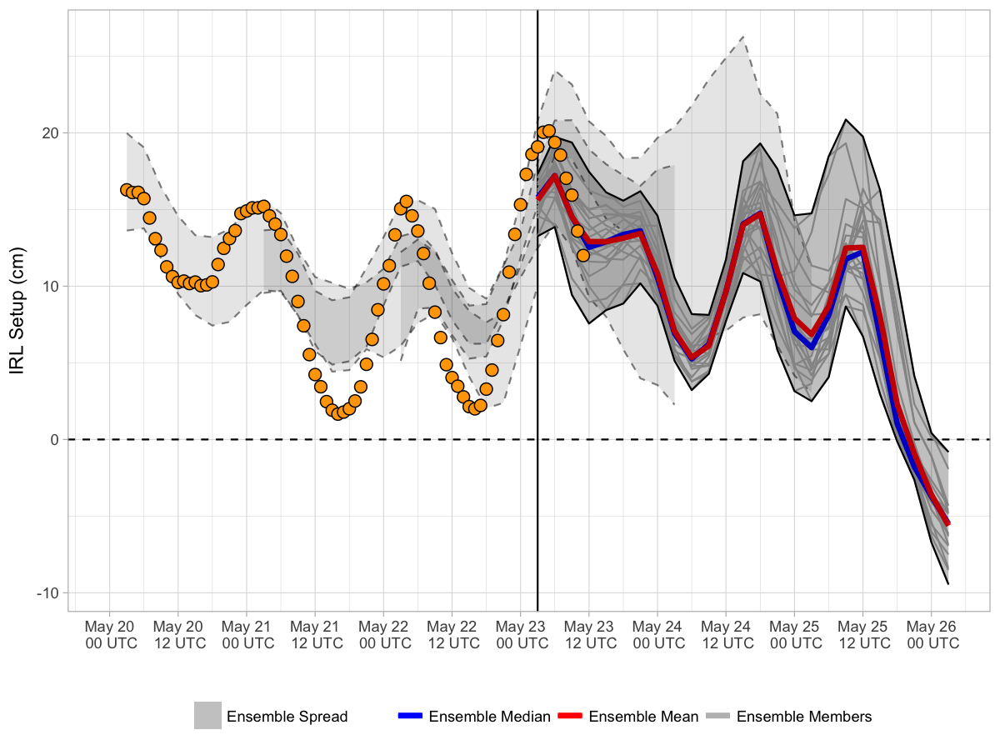

Current Forecast
----------------

> Forecast valid 2017-06-20 10:01:13.

Explanation
-----------

The image above has a lot going on, and the legend is incomplete, so
let's explain the figure. First, the y-axis shows IRL wind setup between
Titusville and Sebastian, in cm. Positive setup indicates increased
water elevation in the northern IRL (near Titusville), and negative
setup indicates the increase elevation in the southern IRL (near
Sebastian). The x-axis displays the date and time in UTC. The solid
vertical line represents the beginning of the most recent ensemble
forecast (currently 2017-06-19 18:00:00). For this most recent forecast,
the ensemble spread (grey shading) is bound by solid black lines, with
individual members represented by faint grey lines. The ensemble mean
and median for this are represented by the red and blue curves,
respectively. Also shown are the ensemble spreads from previous
forecasts (grey shading bounded by dashed grey lines). Finally, real
time observations of wind setup do not exist, but ongoing research by
Colvin et al. (2017, in preparation) calibrates observed wind setup with
wind observations at Melbourne Airport (KMLB). The orange points
represent this parameterized setup given recent KMLB observations, and
in a sense provide quasi-verification to recent forecasts.

About
-----

The above image shows an ensemble-based statistical forecast of water
elevation difference between two sites in the [Indian River Lagoon
(IRL)](https://en.wikipedia.org/wiki/Indian_River_Lagoon). Model data
are provided by the [Global Ensemble Forecast System
(GEFS)](https://www.ncdc.noaa.gov/data-access/model-data/model-datasets/global-ensemble-forecast-system-gefs)
and are verified with wind observations from [Orlando Melbourne
International Airport
(KMLB)](https://en.wikipedia.org/wiki/Orlando_Melbourne_International_Airport).
The statistical model is calibrated to over fifty significant setup
events during the winters of 2015/2016 and 2016/2017 (see [Colvin et al.
2017]()).

Click [here](irl.html) to learn more about IRL research.

Methods
-------

Coming soon ...

Archive
-------

Coming soon ...
