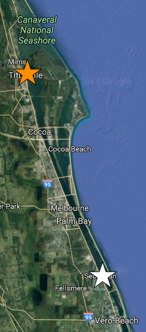

Current Forecast
----------------

> Forecast valid 2017-07-05 14:55:21.

Explanation
-----------

The above image shows the ensemble forecast of [Indian River Lagoon
(IRL)](https://en.wikipedia.org/wiki/Indian_River_Lagoon) setup, defined
as the difference in water elevation between Titusville, FL (orange
star), and Sebastian, FL (white star). In general, southerly (northerly)
winds result in increased water elevation near Titusville (Sebastian)
and positive (negative) setup.

The current (18 UTC 2017-07-04) 0.5° [Global Ensemble Forecast System
(GEFS)](https://www.ncdc.noaa.gov/data-access/model-data/model-datasets/global-ensemble-forecast-system-gefs)
mean and median forecasts of setup are represented by the red and blue
curves, respectively. Ensemble spread from the current and three
previous GEFS runs are shaded grey and bounded by solid and dashed
curves, respectively.

Because real time observations of IRL setup do not exist, for
verification purposes hourly estimates are provided (orange points)
using wind observations from [Orlando Melbourne International Airport
(KMLB)](https://en.wikipedia.org/wiki/Orlando_Melbourne_International_Airport)
following Colvin et al. (2017).

Click [here](irl.html) to learn more about IRL research.

Reference
=========

Colvin, J, S. Lazarus, M. Splitt, and R. Weaver, 2017: In preparation.
